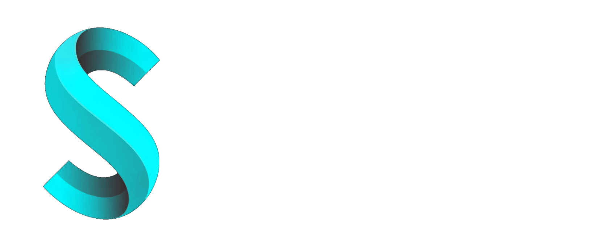

# Seerial Media Server

This is the server application for the suite Seerial. It is a multimedia management server that provides user media to different client applications. Built with a focus on scalability and maintainability using modern web technologies.

## Project Structure

The project follows a modular architecture organized as follows:

- `src/api/v1/`: API version 1 modules
  - Domain-specific directories (e.g., albums, movies, series, users) containing business logic
  - Each domain follows a hexagonal architecture with:
    - `infrastructure/web/controllers/`: Web controllers (adapters for HTTP)
    - `infrastructure/adapters/`: External service adapters (e.g., metadata providers, IMDB scores)
- `src/middleware/`: Express middleware for authentication, sanitization, etc.
- `src/utils/`: Utility functions and helpers
- `src/__tests__/`: Test files using Jest
- `seerial-web/`: Frontend web application (React/Vite-based client)
- `assets/`: Static assets (icons, etc.)

## Architecture

The server implements the **Hexagonal Architecture** (also known as Ports and Adapters architecture). This design pattern separates the core business logic from external concerns, making the system more testable and maintainable.

- **Core Domain**: Business logic and use cases
- **Ports**: Interfaces defining contracts for external interactions
- **Adapters**: Implementations of ports for specific technologies (e.g., web controllers, database adapters, external API clients)

## Technologies

- **Node.js & TypeScript**: Runtime and primary language for type safety
- **Express.js**: Web framework for building REST APIs
- **TSOA**: Framework for building REST APIs with TypeScript decorators, auto-generating OpenAPI specs and routes
- **Jest**: Testing framework for unit and integration tests
- **Sequelize**: ORM for database interactions (SQLite by default)
- **FFmpeg**: Media processing library for video/audio handling
- **Electron**: Cross-platform desktop application framework
- **Sharp**: Image processing library
- **Axios**: HTTP client for external API calls
- **Swagger UI**: API documentation interface

## Getting Started

### Prerequisites

- Node.js (v16+)
- pnpm (recommended) or npm

### Installation

1. Clone the repository:

   ```bash
   git clone https://github.com/juanllavero/seerial-server.git
   cd seerial-server
   ```

2. Install dependencies:
   ```bash
   pnpm install
   ```

During installation, the server automatically rebuilds `better-sqlite3` for the installed Electron version. This prevents the common startup failure where Electron cannot find the native SQLite binding after a fresh install or dependency reset.

If the rebuild is interrupted because Electron or another process is still using the native binary, stop the running server and execute:

```bash
pnpm --dir apps/server run rebuild:electron-native
```

### Development

Run the development server:

```bash
pnpm run dev
```

This will start both the web client and the Electron server concurrently.

## Building

Build for production:

```bash
pnpm run build:distributable
```

This command always rebuilds the web client first and then runs the server build, so `dist/web` is guaranteed to be fresh before packaging.

Build platform-specific executables:

```bash
pnpm run build-win    # Windows
pnpm run build-mac    # macOS
pnpm run build-linux  # Linux
```

### Testing

Run tests:

```bash
pnpm run tests
```

### API Documentation

After running the server, visit `http://localhost:3000/api-docs` for Swagger UI documentation generated by TSOA.

## License

GNU GENERAL PUBLIC LICENSE - see [LICENSE](LICENSE) for details.
